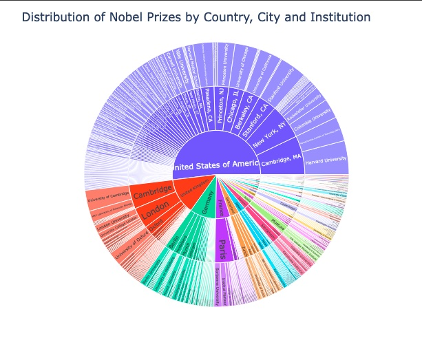

# Good old Alfred Nobel and his Prizes. Analyses like these have the power to really open the mind.  Learn more charting techniques with Plotly, MatPlotLib, and Seaborn and discover some interesting facts about the coveted prizes.
- 👋 Hi, I’m @WilliamSpanfelner
- 👀 I’m interested in using Python with Swift in iOS environments and why it may or may not be desirable.
- 🌱 I’m currently learning Python with the London App Brewery and Angela Yu's [100 Days of Code: 
The Complete Python Pro Bootcamp for 2022](https://www.udemy.com/course/100-days-of-code/) on Udemy.  
- 🧑‍💻  Clean and make some conversions to the data set. Create a donut chart to visualise the relative percentages of winners by gender; see the number of prizes awarded per category; then see how those categories are divided by gender. Check out the chart images here and for a more detailed look open the Colab Notebook to see the result first hand.  Some are quite surprising.  Enjoy. 
- 💞️ I’m looking to collaborate on application development.
- 📫 How to reach me...

[//]: # ([![email]&#40;https://img.shields.io/badge/email-wil--1--am%40outlook.com-grey?style=plastic&#41;]&#40;mailto:wil-1-am@outlook.com&#41;)

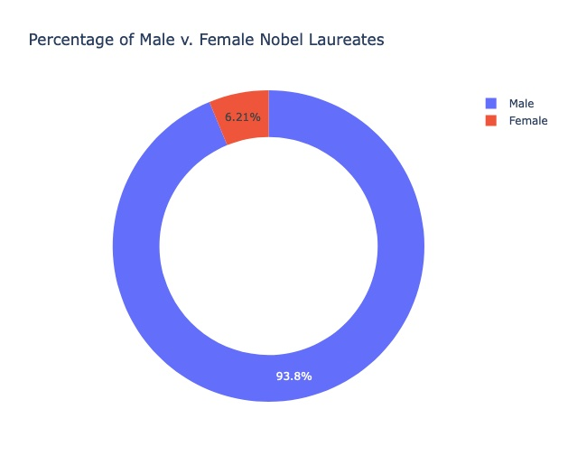
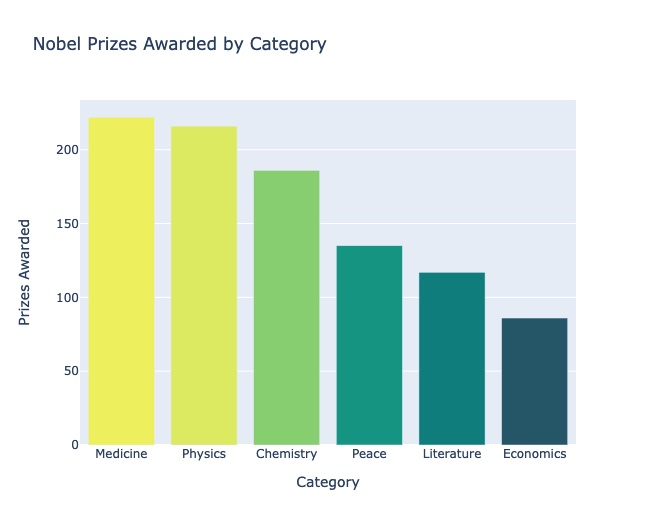
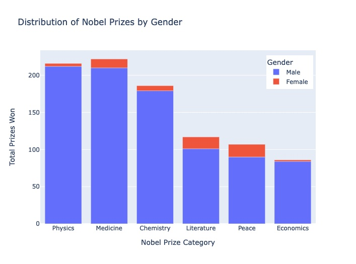
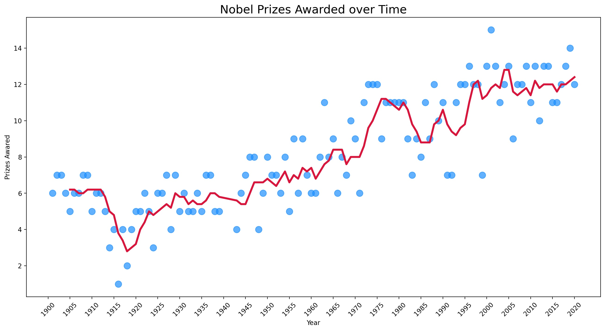
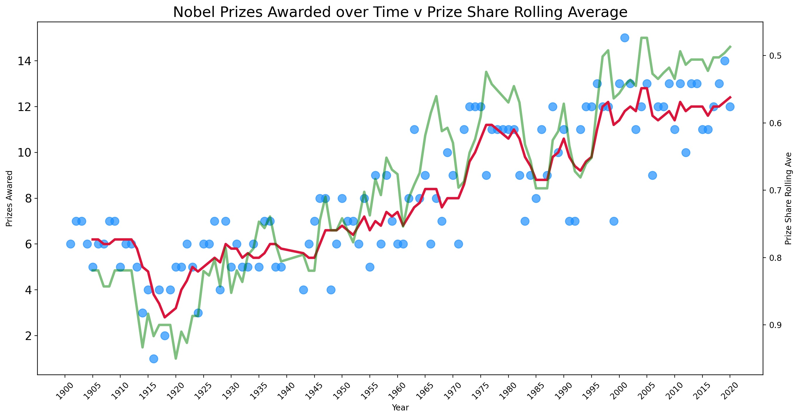
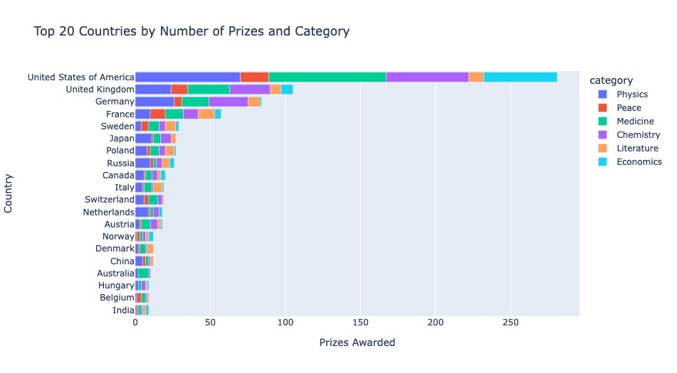
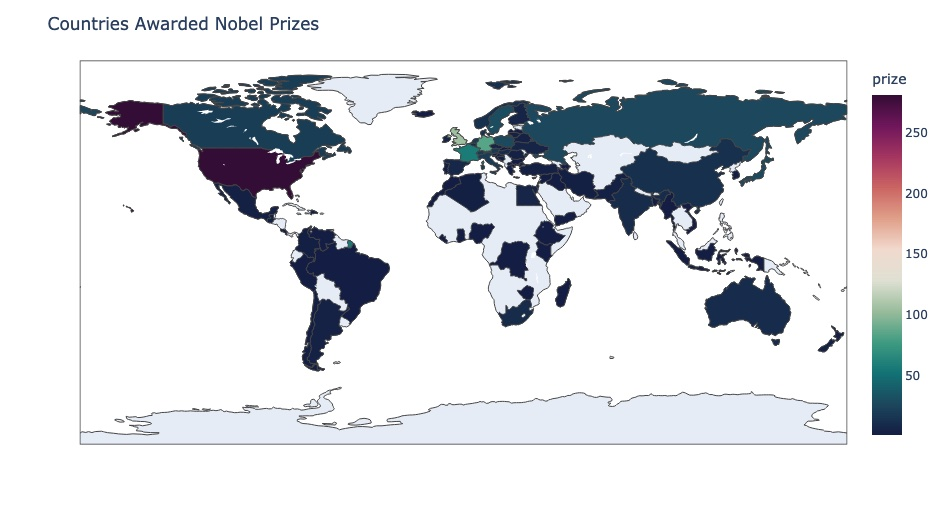
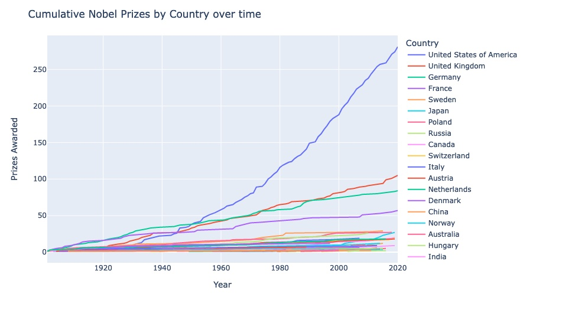
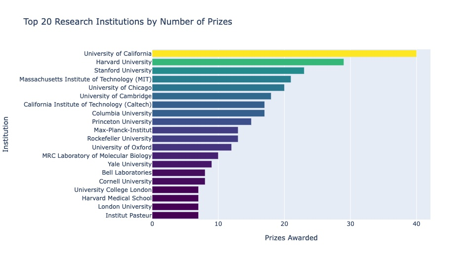
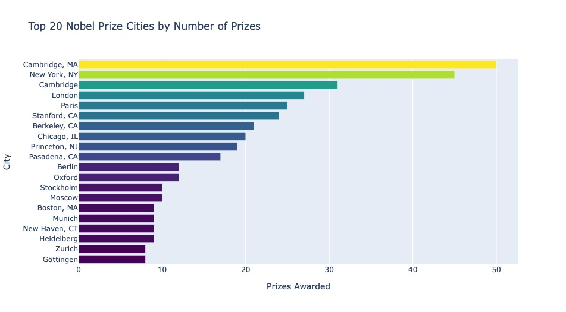
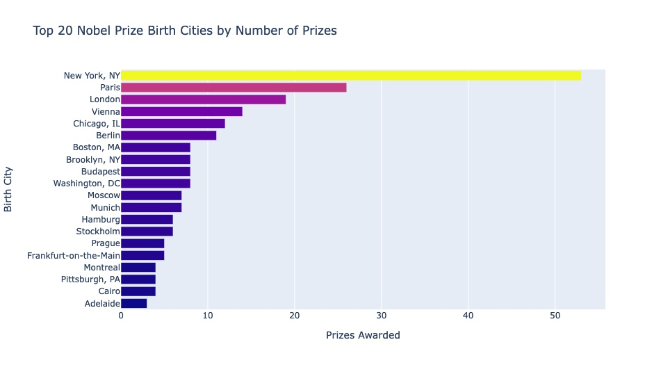
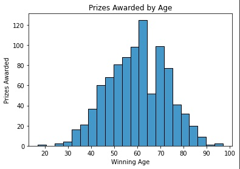
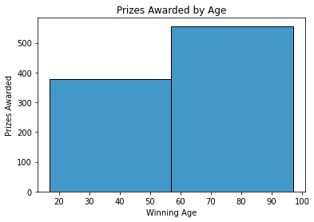
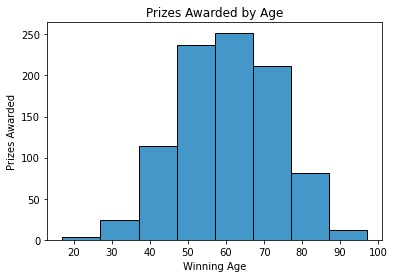
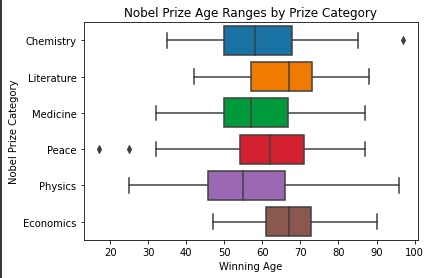
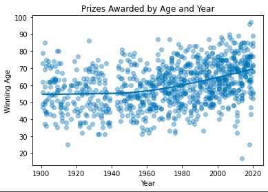

Analysing the Nobel_Prize_Analysis_with_Plotly, MatPlotLib, and Seaborn